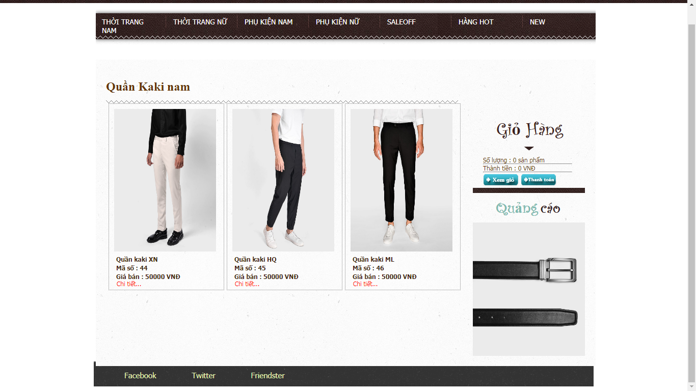
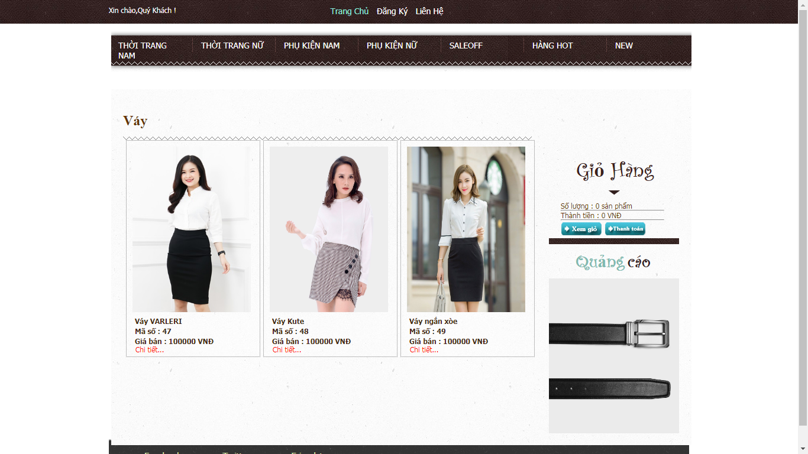
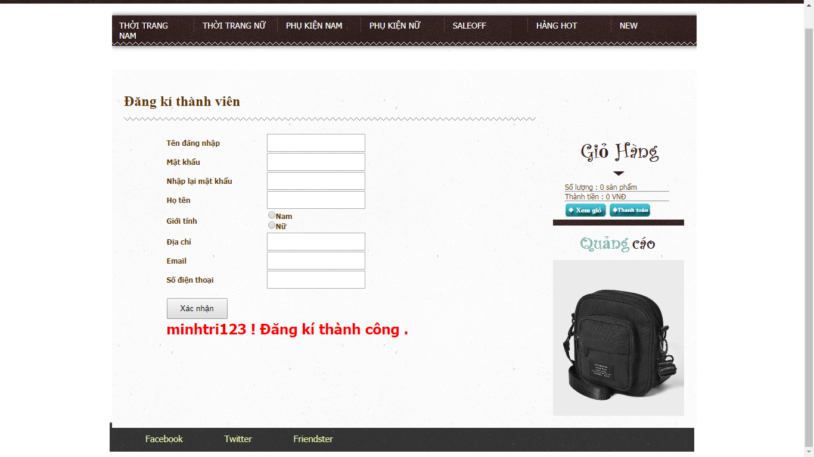
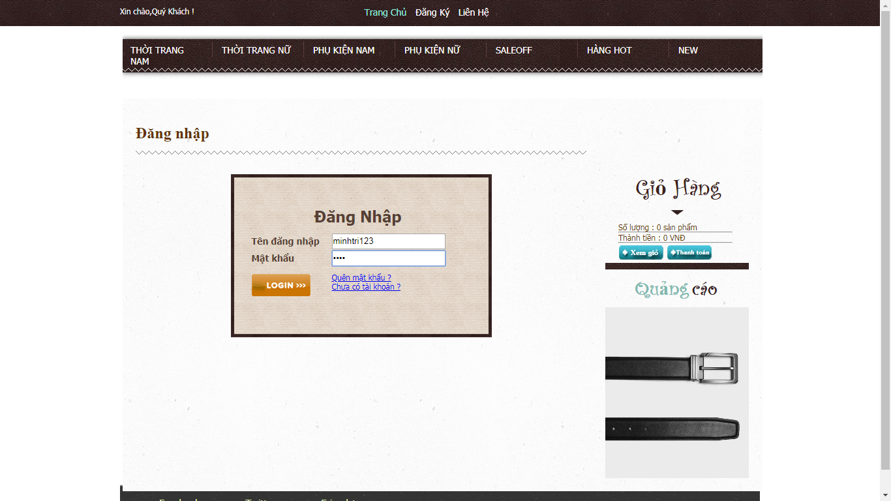
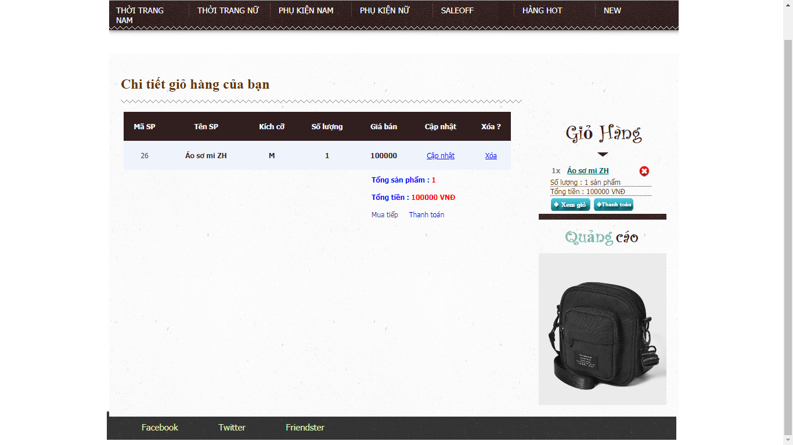

# ShopQuanAo
SHOP BÁN QUẦN ÁO NAM NỮ  
*Giao Diện Trang Chủ 
HEADER

FOOTER

*Những Mục Hàng Chính: 
-Thời Trang Nam: 
+Áo Thun 
+Áo Sơmi 
+Áo Khoác 
+Quần Jean 
+Quần KaKi 

+Áo Thun Nam 

+Áo Sơ Mi Nam 

+Áo Khoác Nam 

+Quần Jean Nam 

+Quần KaKi Nam 

-Thời Trang Nữ: 
+Áo Thun 
+Áo Sơmi 
+Áo Khoác 
+Quần Jean 
+Váy  
+Áo Thun Nữ: 

+Áo Khoác Nữ 

+Quần Jean Nữ 

+Váy Nữ 

 
*Giao Diện Mua Hàng:

*Tính Năng Bình Luận Của Khách Hàng: 
-Lưu Dữ Liệu Trong SQL

*Muốn Mua Hàng Bắt Buộc Phải Đăng Ký: 

*Đăng Ký Không Thành Công Nếu Thiếu,Sai,Trùng Thông Tin: 

*Đăng Ký Thành Công: 

*Đăng Nhập:

*Đăng Nhập Thành Công: 

*Chi Tiết Giỏ Hàng: 

*Xác Nhận Mua Hàng: 

